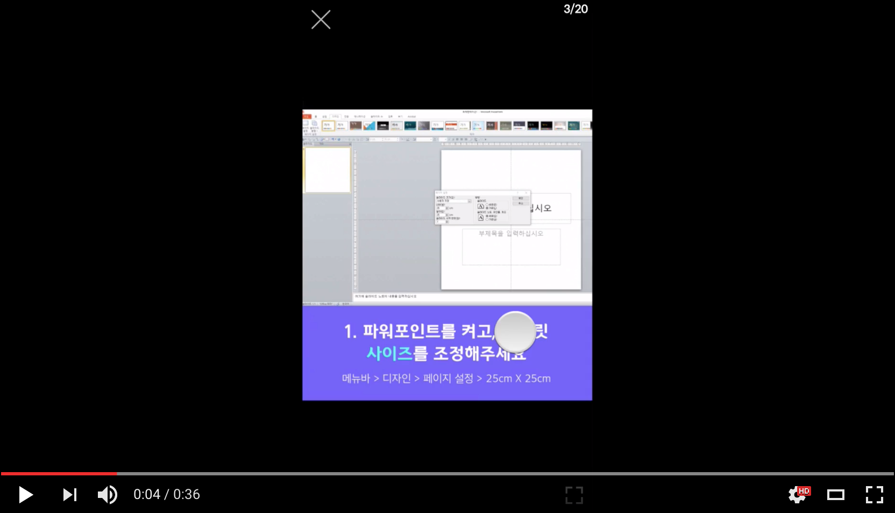

#Tyle Player - A free jQuery plugin

##What's this ?
Tyle Player is a javascript player for contents images like newscard, social graphics, and so on. It supports all of the major browsers.

[](https://www.youtube.com/watch?v=pjcGwRyaqY0)

You can check the detailed demos [here](https://tyle.io/cards).


##Browser Support

IE 9+, Chrome, Firefox, Safari, Opera (including Mobile devices).


##Options

The roundSlider has several properties and events to interact with the control programmatically.

To know more about the Options, please check the documentation.
```javascript
$(selectol).tylePlayer([
    'https://....jpg',
    'https://....jpg',
    'https://....jpg',
],
{
    width: 510,
    height: 510,
    background: '#000',
    enablePageIndicator : true,
    enableFullscreen : true,
    lastSlideLabel : 'AI Design Tool',
    lastSlideLink : 'https://tyle.io',
    onStart : function(){
        console.log("onStart");
    },
    onEnd : function(){
        console.log("onEnd");
    },
    onNext : function(slideNo){
        console.log("next slideNo", slideNo);
    },
    onPrev : function(slideNo){
        console.log("prev slideNo", slideNo);
    },
    onReplay : function(){
        console.log("replay");
    }
});
```

##Licence
Tyle Player is licensed under the terms of the [MIT license](http://roundsliderui.com/licence.html).
